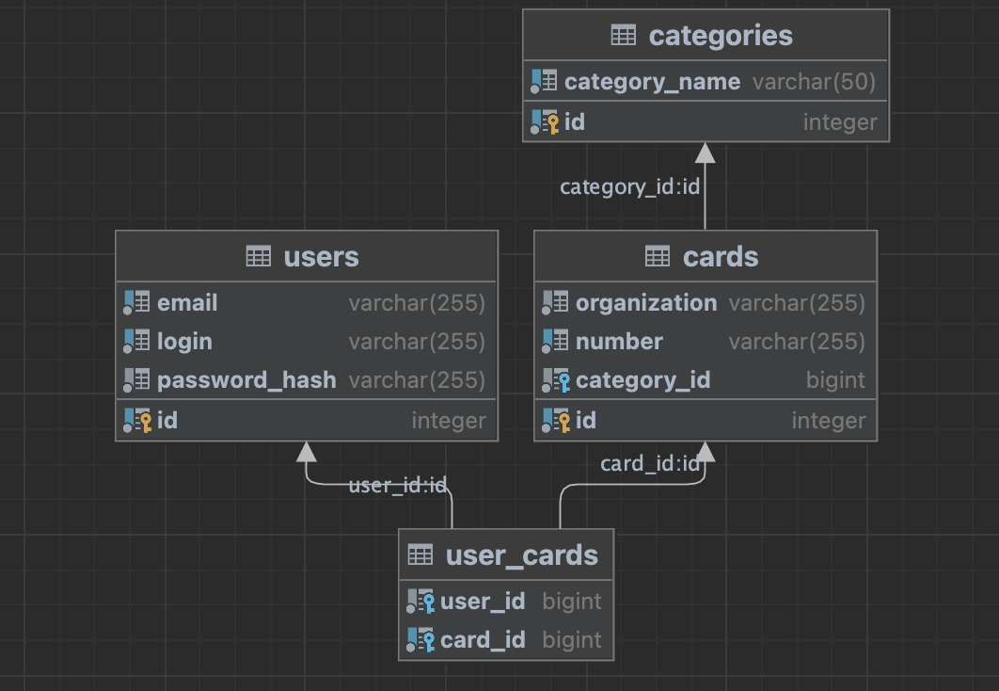
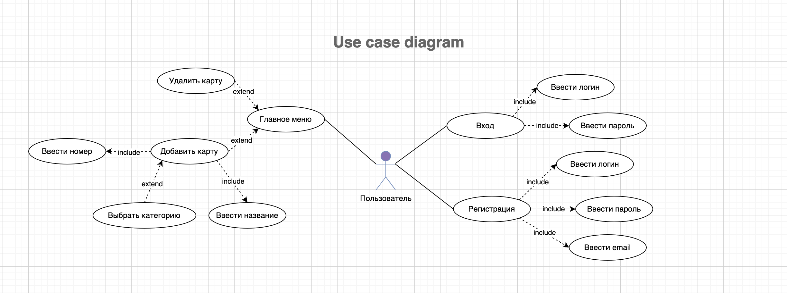

# Hand card

## 1. Цель проекта
Цель проекта - разработаь приложение для ранжирования скидочных кард клиента по геолокации

## 2. Описание системы

### 2.1 Функционал пользователя

#### 2.1.1 Авторизация

- Регистрация

- Вход

#### 2.1.2 Просмотр скидочных карт

Список с обложкой скидочных карт (Пример: Чашка кофе)

#### 2.1.3 Pop up

Пользователь нажимает на карточку, которая маштабируется на весь экран:

- Название (Пример: Чашка кофе)

- Номер (Пример: 12345de545421)

- Категория (Пример: Кафе)

#### 2.1.4 Добавление карты

- Название (Пример: Чашка кофе)

- Номер (Пример: 12345de545421)

- Категория (Пример: Кафе)

#### 2.1.5 Удаление карты

#### 2.1.6 Ранжирование карт по геолокации

## 3. Стек технологий

### Бекенд

- Язык - `Go`

- БД - `Postgres`

- Фреймворк [Gin](https://github.com/gin-gonic/gin)

- Конфигурация приложения - [cleanenv](https://github.com/ilyakaznacheev/cleanenv)

- Работа с БД - [sqlx](https://github.com/jmoiron/sqlx)

- Логер - [logrus](https://github.com/sirupsen/logrus)

- Работа с токеном - [JWT](https://github.com/golang-jwt/jwt)

- Env конфигуратор

### Фронтенд

- Язык - [Flutter/Dart](https://flutter.dev)

### DevOps
- Сборка - `Docker`

- `CI/CD`

## 4. Архитектура

### Бекенд `/backend`

За основу взята чистая архитектура [clean architecture](https://blog.cleancoder.com/uncle-bob/2012/08/13/the-clean-architecture.html)

#### Директории:
- `/cmd` - запуск приложения

- `/config` - работа с конфигом

- `/db` - миграции

- `/internal` - архитектура проекта

- `/cmd` - подключение дополнительных пакетов и работа с внешними api

#### Пакеты:

`/pkg`:

- `/server` - настройка сервиса

- `/map_api` - интерфейс работы с внешним api

- `/map_api/gis_api` -  реализация интерфейса работы с внешним api (2Гис api)

- `/postgres` - настройка postgres

`internal`:

- `/app` - сборка всех пакетов для работы сервиса

- `/controller/http/v1` - работа с роутерами и фреймворком Gin и middleware аутентификации

- `/controller/http/dto` - сущности, которые передааются и принимаются от клиента

- `/domain` - интерфейс бизнесс логики

- `/domain/use_case` - реализация интерфейсов бизнесс логики

- `/entities` - сущности, которые передаются в бизнесс логике

- `/adapter/db` - интерфейс работы с бд

- `/adapter/db/postgres_db` - реализация интерфейса работы с бд (Postgres SQL)

### Фронтенд `/mobile`

Архитектрура  MVC

#### `/lib`:

- `/main.dart` - запуск приложения

- `/pages` - верстка экранов (View)

- `/controller` - запросы к бекенду (Controller)

- `/model` - сущности приложения

- `/service` - реализация дополнительных пакетов для работы

Экраны:

#### `/pages`:

- `/sign-in_page.dart` - страница с входом

- `/sign-up_page.dart` - страница с регистрацией

- `/home_page.dart` - главная страница

## 5. Диаграмма БД

### Сущности:
 
`users` - данные пользователя

`сards` - данные карты

`categories` - информация о категории карты

`user_cards` - пользователи и карты

## 6. Use case диаграмма

## 7. Use case

### Вход в систему

| Наименование Use case | Вход в систему                                                  |
|-----------------------|-----------------------------------------------------------------|
| Описание              | Вход пользователя в систему для получения доступа к функционалу |
| Акторы                | Пользователь |
| Предусловия           | Подключение системы к сети |

| Основноые сценарии | Номер |        Шаги                                             |
|--------------------|-------|---------------------------------------------------------|
|    Пользователь    |   1   | Ввод логина и пароля                                    |
|                    |   2   | Проверка системой имени пользователя и пароля           |
|                    |   3   | Система назначает JWT токен пользователю на 12 часов    |
|   Результат        |   4   | Пользователь входит в основное меню                     |
|   Расширения       |   1а  | Ошибка ввода данных пользователя. Система выдает ошибку. Переход на 1 шаг |

### Добавление карты

| Наименование Use case | Добавление карты                                                  |
|-----------------------|-------------------------------------------------------------------|
| Описание              | Добавление скидочной карты в приложение                           |
| Акторы                | Пользователь                                                      |
| Предусловия           | Вход в систему                                                    |

| Основноые сценарии | Номер |        Шаги                                             |
|--------------------|-------|---------------------------------------------------------|
|    Пользователь    |   1   | Ввод название, номер, категория карты                   |
|                    |   2   | Проверка системой названия, номера, категории           |
|                    |   3   | Система проверяет JWT токен пользователя                |
|                    |   4   | Система создает новую запись в БД                       |
|                    |   5   | Система выдает сообщение об успешном добавление карты   |
|   Результат        |   -   | Карта появляется в списке карт пользователя             |
|   Расширения       |   1а  | Карта с данным номером уже существует. Система показывает сообщение об ошибке. Переход на 1 шаг |

### Показ карт

| Наименование Use case | Показ карт                                                 |
|-----------------------|-------------------------------------------------------------------|
| Описание              | Пользователь входит в главное меню                           |
| Акторы                | Пользователь                                                      |
| Предусловия           | Вход в систему                                                    |

| Основноые сценарии | Номер |        Шаги                                             |
|--------------------|-------|---------------------------------------------------------|
|    Пользователь    |   1   | Система оопределяет координаты пользователя             |
|                    |   2   | Система отправляет координаты пользователя API          |
|                    |   3   | Система проверяет наличие координат                     |
|                    |   4   | Система делает запрос к бд, для выбора карт пользователя|
|                    |   5   | Система делает запрос к внешнему API для определения списка организаций по близости с пользователем |
|                    |   6   | Система сравнивает карты пользователя с организациями   |
|                    |   7   | Система отправляет на устройство пользователя список ранжируемых карт |
|  Результат         |   -   | Пользователь ввидит на экране свои скидочные карты |
|  Расширения        |   3а  | Координаты пользователя отсутствуют. Система выводит не ранжированный список карт пользователя |
|  Расширения        |   4а  | Сбой работы с внешним api. Система выводит не ранжированный список карт пользователя |
